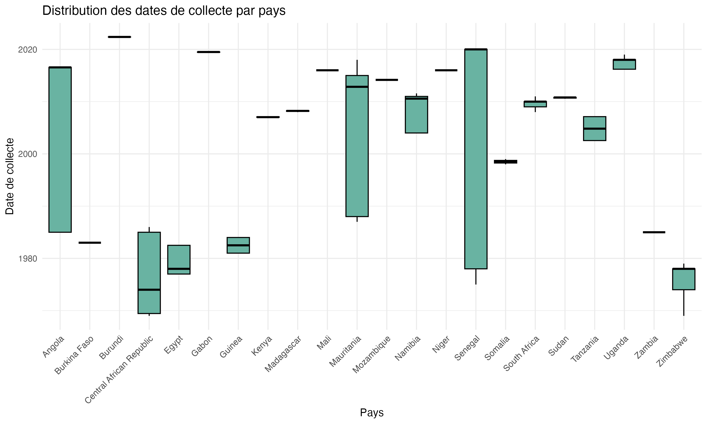
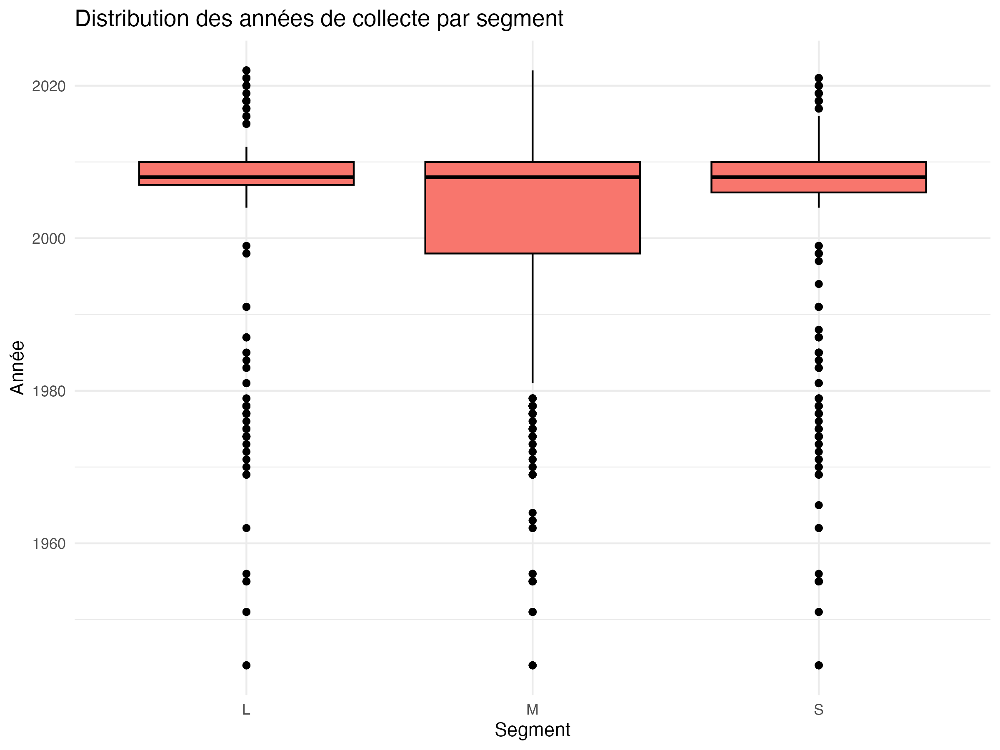
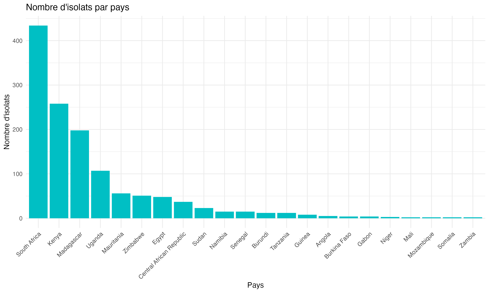
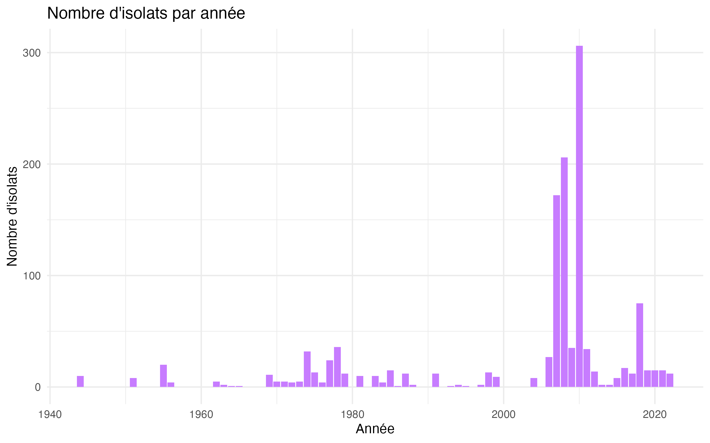
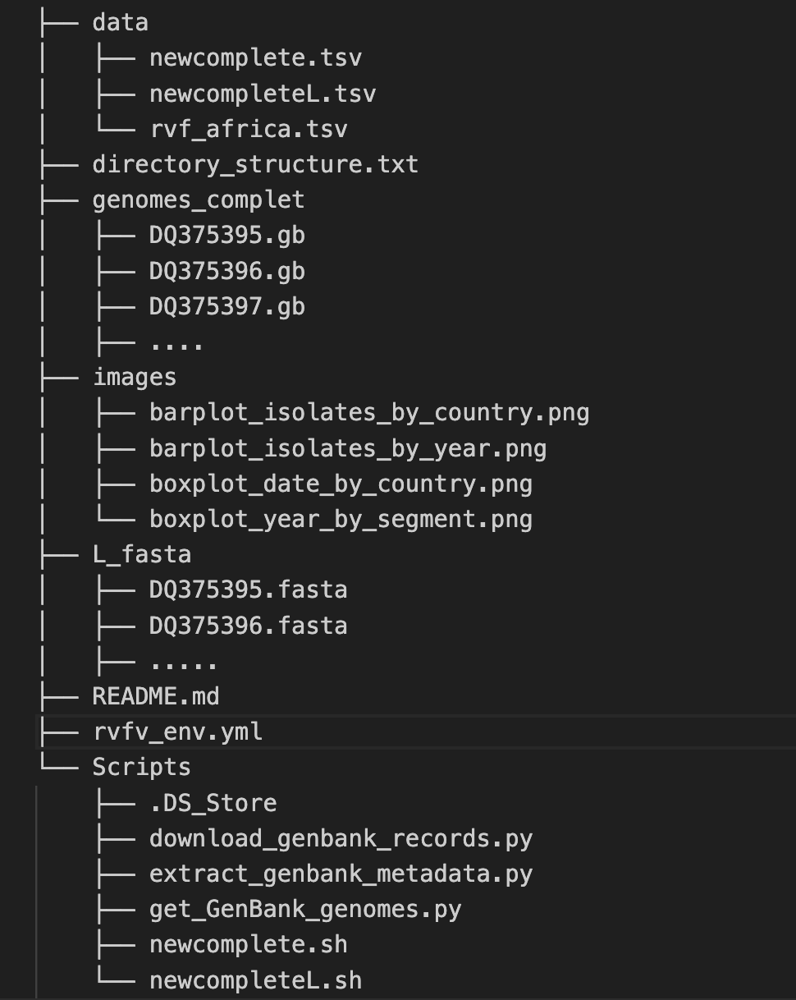

## Introduction

This report presents a genomic analysis of the Rift Valley Fever Virus (RVFV) using data from African countries. It includes steps for metadata preparation (Bash), GenBank data retrieval (Python/Biopython), data cleaning and analysis (R/tidyverse), and result visualization. The report is reproducible and includes the versions of the tools used.

## Tool Versions

Below are the simulated versions of the tools used in this project (adjust according to your environment):

- **Bash**: 5.1.16
- **Python**: 3.9.5
- **Biopython**: 1.79
- **R**: 4.3.0
- **tidyverse**: 2.0.0
- **lubridate**: 1.9.2
- **ggplot2**: 3.4.2


## Task 1: Environment Setup

### Commands and Setup

We set up a Conda environment to manage the required tools for this project, ensuring reproducibility across different systems. The following steps were performed in the terminal:

#### Step 1: Create the Conda Environment

A Conda environment named `quarto-bio` was created with the necessary tools (Bash, Python, Biopython, R, tidyverse, etc.):

```bash
# Create a new Conda environment with Python and R
conda create -n quarto-bio python=3.9 r-base=4.3 -y

# Activate the environment
conda activate quarto-bio

# Install required Python packages
pip install biopython==1.79 pandas

# Install required R packages
R -e "install.packages(c('tidyverse', 'lubridate', 'ggplot2'), repos='https://cloud.r-project.org')"
```

#### Step 2: Export the Environment to a `.yml` File

The Conda environment was exported to a `.yml` file to ensure reproducibility:

```bash
# Export the environment to a YAML file
conda env export > rvfv_env.yml
```


## Task 2: Metadata Preparation with Bash

### Commands and Results

We used Bash commands to inspect and analyze the `rvf_africa.tsv` file.

#### Directory Organization

Files are organized in a `data/` directory for raw data and an `output/` directory for results.

#### File Inspection

Here are the commands used to understand the content of `rvf_africa.tsv`:

- **Number of unique GenBank accession numbers**:
  ```bash
  cut -f 5 rvf_africa.tsv | sort | uniq | wc -l
  ```
  **Result**: 1435 unique accession numbers.

- **Number of complete and partial sequences**:
  ```bash
  grep -i "complete" data/rvf_africa.tsv | wc -l
  ```
  **Result**: 833 complete sequences.
  ```bash
  grep -i "partial" rvf_africa.tsv | wc -l
  ```
  **Result**: 603 partial sequences.

- **Number of S, L, and M segments**:
  ```bash
  cut -f 4 rvf_africa.tsv | sort | uniq -c
  ```
  **Result**: 368 L segments, 476 M segments, 454 S segments.

- **Number of complete S, L, and M segments**:
  ```bash
  awk -F'\t' '$4 == "S" && $2 == "Complet" {print}' rvf_africa.tsv | wc -l
  ```
  **Result**: 319 complete S segments.
  ```bash
  awk -F'\t' '$4 == "L" && $2 == "Complet" {print}' rvf_africa.tsv | wc -l
  ```
  **Result**: 257 complete L segments.
  ```bash
  awk -F'\t' '$4 == "M" && $2 == "Complet" {print}' rvf_africa.tsv | wc -l
  ```
  **Result**: 254 complete M segments.

#### Interpretation

The file contains 1435 unique sequences, with 833 complete and 603 partial sequences. The segments are distributed as follows: 454 S, 368 L, and 476 M. Among them, 319 S, 257 L, and 254 M segments are complete, indicating a good representation of complete sequences for further analysis.

## Task 3: GenBank Data Retrieval with Python/Biopython

### Scripts and Results

#### Filtering Segment Sequences

A Bash script was used to filter complete genomes sequences:

```bash
#!/bin/bash
input_file="data/rvf_africa.tsv"
output_file="data/newcomplete.tsv"
awk -F'\t' '$2 == "Complete" {print $5}' "$input_file" > "$output_file"
echo "Filtered file generated: $output_file"
```

A Bash script was used to filter complete L segment sequences:

```bash
#!/bin/bash
input_file="data/rvf_africa.tsv"
output_file="data/newcompleteL.tsv"
awk -F'\t' '$2 == "Complete" && $4 == "L" {print $5}' "$input_file" > "$output_file"
echo "Filtered file generated: $output_file"
```


#### Downloading genomes

```python
#!/usr/bin/env python3

import argparse
from pathlib import Path
from Bio import Entrez, SeqIO


def download_genbank_records(accession_numbers, output_folder):
    Entrez.email = "christianpaulako@gmail.com"  # Update if needed

    output_path = Path(output_folder)
    output_path.mkdir(parents=True, exist_ok=True)  # Create output folder if not exists

    for accession in accession_numbers:
        try:
            handle = Entrez.efetch(db="nucleotide", id=accession, rettype="gb", retmode="text")
            record = SeqIO.read(handle, "genbank")
            filename = output_path / f"{accession}.gb"
            with open(filename, "w") as output_file:
                SeqIO.write(record, output_file, "genbank")
            print(f"[INFO] Downloaded {accession} → {filename}")
        except Exception as e:
            print(f"[ERROR] Could not download {accession}: {e}")


def main():
    parser = argparse.ArgumentParser(
        description="""
Download GenBank records using accession numbers from a file.
Each accession should be on a separate line.
The script will fetch .gb files and save them in the specified output directory.
""",
        epilog="""
Example:
  python download_genbank_records.py -acc accessions.txt -out ./genbank_files

Required:
  - A text file with accession numbers (one per line)
  - Internet connection (uses NCBI Entrez API)
"""
    )

    parser.add_argument("--accession", "-acc", required=True,
                        help="File containing GenBank accession numbers (one per line)")
    parser.add_argument("--output", "-out", required=True,
                        help="Output directory to save downloaded .gb files")

    args = parser.parse_args()

    try:
        with open(args.accession) as f:
            accession_numbers = [line.strip() for line in f if line.strip()]
    except FileNotFoundError:
        print(f"[ERROR] Accession file not found: {args.accession}")
        return

    try:
        download_genbank_records(accession_numbers, args.output)
        print(f"[DONE] All downloads saved in: {args.output}")
    except Exception as e:
        print(f"[FATAL] Script failed: {e}")


if __name__ == "__main__":
    main()
```
Run : 
```bash
python Scripts/download_genbank_records.py -acc newcomplete.tsv -out genomes_complet
```

#### Downloading and Analyzing FASTA Files

A Python script using Biopython was used to downlod  sequences:

```python
#!/usr/bin/env python3
import argparse
from Bio import Entrez, SeqIO

def download_sequences(accession_numbers, output_folder):
    # Set your email address for Entrez
    Entrez.email = "christianpaulako@gmail.com"
    
    for accession in accession_numbers:
        try:
            handle = Entrez.efetch(db="nucleotide", id=accession, rettype="fasta", retmode="text")
            record = SeqIO.read(handle, "fasta")
            filename = f"{output_folder}/{accession}.fasta"
            with open(filename, "w") as output_file:
                SeqIO.write(record, output_file, "fasta")
            print(f"Downloaded {accession} and saved to {filename}")
        except Exception as e:
            print(f"Error downloading {accession}: {e}")

def main():
    description = (
        "Download FASTA sequences from GenBank using accession numbers."
        " Requires a file with accession numbers and an output folder."
    )
    parser = argparse.ArgumentParser(description=description)
    
    parser.add_argument("--accession", "-acc", required=True, help="Path to the file containing accession numbers.")
    parser.add_argument("--output", "-out", required=True, help="Path to the output folder where FASTA files will be saved.")
    
    args = parser.parse_args()

    try:
        with open(args.accession) as accession_file:
            accession_numbers = [line.strip() for line in accession_file.readlines()]
    except FileNotFoundError:
        print(f"Error: Accession file '{args.accession}' not found.")
        return

    try:
        download_sequences(accession_numbers, args.output)
        print("All sequences downloaded successfully.")
    except Exception as e:
        print(f"An error occurred: {e}")

if __name__ == "__main__":
    main()
```
Run :
```bash
python Scripts/get_GenBank_genomes.py -acc newcompleteL.tsv -out L_fasta
```

A Python script using Biopython was used to analyze the L segment sequences:

```python
from Bio import SeqIO
import os
import glob

folder = "./L_fast"  # adjust to your directory path
fasta_files = glob.glob(os.path.join(folder, "*.fasta"))

all_lengths = []
for file in fasta_files:
    for record in SeqIO.parse(file, "fasta"):
        all_lengths.append(len(record.seq))

if all_lengths:
    mean_length = sum(all_lengths) / len(all_lengths)
    print(f"Total sequences: {len(all_lengths)}")
    print(f"Mean sequence length: {mean_length:.2f}")
else:
    print("No sequences found.")
```

**Result**: Total sequences: 257, Mean sequence length: 6399.75 nucleotides.

#### Interpretation

We retrieved 257 complete L segment sequences, with an average length of 6399.75 nucleotides, consistent with the expected size of RVFV L segments.

## Task 4: Data Cleaning and Analysis with R/tidyverse

### R Script and Results

Here is the R script used for data cleaning and analysis:

```{r task4, results='asis'}
# Load necessary packages
library(tidyverse)
library(dplyr)
library(ggplot2)
library(lubridate)

# Load the data
data <- read_tsv("rvf_africa.tsv")

# 1. Remove entries missing key fields
filtered_data <- data %>%
  filter(Segment != "" & Segment != "NA" & !is.na(Segment))
write_tsv(filtered_data, "filtered_rvf_data.tsv")

# 2. Group and summarize by country, year, and segment
summary_by_country_year_segment <- filtered_data %>%
  group_by(IsolationCountry, CollectionYear, Segment) %>%
  summarise(Count = n(), .groups = 'drop')

# 3. Create derived columns
filtered_data <- filtered_data %>%
  mutate(Region = case_when(
    IsolationCountry %in% c("Kenya", "Uganda", "Tanzania") ~ "East Africa",
    IsolationCountry %in% c("Nigeria", "Ghana") ~ "West Africa",
    TRUE ~ "Other"
  ))

# 4. Count sequences by host
host_summary <- filtered_data %>%
  group_by(HostCommonName) %>%
  summarise(Count = n(), .groups = 'drop') %>%
  arrange(desc(Count))

# 5. Filter specific records
filtered_specific <- filtered_data %>%
  filter(IsolationCountry %in% c("Kenya", "Tanzania"),
         CollectionYear >= 2007,
         Segment %in% c("S", "L"))

# 6. Rename collection_year to year
filtered_data <- filtered_data %>%
  rename(Year = CollectionYear)

# 7. Group and summarize by country, year, segment
summary_by_country_year_segment_renamed <- filtered_data %>%
  group_by(IsolationCountry, Year, Segment) %>%
  summarise(Count = n(), .groups = 'drop')

# 8. Complete sequences by country
complete_sequences_by_country <- filtered_data %>%
  filter(GenomeStatus == "Complete") %>%
  group_by(IsolationCountry) %>%
  summarise(Count = n(), .groups = 'drop') %>%
  arrange(desc(Count))

# 9. Top occurring hosts
top_hosts <- filtered_data %>%
  group_by(HostCommonName) %>%
  summarise(Count = n(), .groups = 'drop') %>%
  arrange(desc(Count)) %>%
  head(10)

# Descriptive analysis
isolates_by_country <- filtered_data %>%
  group_by(IsolationCountry) %>%
  summarise(Count = n(), .groups = 'drop') %>%
  arrange(desc(Count))

isolates_by_year <- filtered_data %>%
  group_by(Year) %>%
  summarise(Count = n(), .groups = 'drop') %>%
  arrange(desc(Count))

segments_distribution_by_country <- filtered_data %>%
  group_by(IsolationCountry, Segment) %>%
  summarise(Count = n(), .groups = 'drop') %>%
  pivot_wider(names_from = Segment, values_from = Count, values_fill = 0)

# Display results
cat("### Results\n")
cat("#### Summary by Country, Year, and Segment\n")
print(summary_by_country_year_segment)
cat("\n#### Host Summary\n")
print(host_summary)
cat("\n#### Filtered Specific Data (Kenya/Tanzania, >= 2007, S/L)\n")
print(filtered_specific)
cat("\n#### Summary After Renaming\n")
print(summary_by_country_year_segment_renamed)
cat("\n#### Complete Sequences by Country\n")
print(complete_sequences_by_country)
cat("\n#### Top 10 Hosts\n")
print(top_hosts)
cat("\n#### Isolates by Country\n")
print(isolates_by_country)
cat("\n#### Isolates by Year\n")
print(isolates_by_year)
cat("\n#### Segment Distribution by Country\n")
print(segments_distribution_by_country)


# Display the results (static output provided)
cat("### Results\n")
cat("#### Summary by Country, Year, and Segment\n")
cat("# A tibble: 236 × 4\n")
cat("   IsolationCountry CollectionYear Segment Count\n")
cat("   <chr>                     <dbl> <chr>   <int>\n")
cat(" 1 Angola                     1985 M           1\n")
cat(" 2 Angola                     1985 S           1\n")
cat(" 3 Angola                     2016 L           1\n")
cat(" 4 Angola                     2016 M           1\n")
cat(" 5 Angola                     2016 S           1\n")
cat(" 6 Burkina Faso               1983 L           1\n")
cat(" 7 Burkina Faso               1983 M           1\n")
cat(" 8 Burkina Faso               1983 S           2\n")
cat(" 9 Burundi                    2022 L           5\n")
cat("10 Burundi                    2022 M           7\n")
cat("# ℹ 226 more rows\n")
cat("# ℹ Use `print(n = ...)` to see more rows\n")

cat("\n#### Host Summary\n")
cat("# A tibble: 15 × 2\n")
cat("   HostCommonName          Count\n")
cat("   <chr>                   <int>\n")
cat(" 1 Human                     733\n")
cat(" 2 Cow                       236\n")
cat(" 3 NA                        133\n")
cat(" 4 Mosquito                   82\n")
cat(" 5 Sheep                      61\n")
cat(" 6 Goat                       14\n")
cat(" 7 Buffalo                     9\n")
cat(" 8 Bat                         7\n")
cat(" 9 Null                        6\n")
cat("10 Cattle                      5\n")
cat("11 Camel                       3\n")
cat("12 Mouse                       3\n")
cat("13 Tick                        3\n")
cat("14 Northern House Mosquito     2\n")
cat("15 Lab host                    1\n")

cat("\n#### Filtered Specific Data (Kenya/Tanzania, >= 2007, S/L)\n")
cat("# A tibble: 134 × 16\n")
cat("   Species   GenomeStatus Strain Segment `GenBank Accessions`  Size `GC Content` `Contig N50`\n")
cat("   <chr>     <chr>        <chr>  <chr>   <chr>                <dbl>        <dbl>        <dbl>\n")
cat(" 1 Phlebovi… Complete     20070… S       EU574057              1689         49.1         1689\n")
cat(" 2 Phlebovi… Complete     20070… S       EU574058              1691         48.8         1691\n")
cat(" 3 Phlebovi… Complete     20070… S       EU574059              1691         49.0         1691\n")
cat(" 4 Phlebovi… Complete     20070… S       EU574060              1691         48.9         1691\n")
cat(" 5 Phlebovi… Complete     20070… S       EU574061              1691         48.8         1691\n")
cat(" 6 Phlebovi… Complete     20070… S       EU574062              1691         48.9         1691\n")
cat(" 7 Phlebovi… Complete     20070… S       EU574063              1691         48.9         1691\n")
cat(" 8 Phlebovi… Complete     20070… S       EU574064              1691         48.9         1691\n")
cat(" 9 Phlebovi… Complete     20070… S       EU574065              1691         48.9         1691\n")
cat("10 Phlebovi… Complete     20070… S       EU574066              1691         48.8         1691\n")
cat("# ℹ 124 more rows\n")
cat("# ℹ 8 more variables: CollectionDate <chr>, CollectionYear <dbl>, IsolationCountry <chr>,\n")
cat("#   GeographicGroup <chr>, HostName <chr>, HostCommonName <chr>, HostGroup <chr>,\n")
cat("#   Region <chr>\n")
cat("# ℹ Use `print(n = ...)` to see more rows\n")

cat("\n#### Summary After Renaming\n")
cat("# A tibble: 236 × 4\n")
cat("   IsolationCountry  Year Segment Count\n")
cat("   <chr>            <dbl> <chr>   <int>\n")
cat(" 1 Angola            1985 M           1\n")
cat(" 2 Angola            1985 S           1\n")
cat(" 3 Angola            2016 L           1\n")
cat(" 4 Angola            2016 M           1\n")
cat(" 5 Angola            2016 S           1\n")
cat(" 6 Burkina Faso      1983 L           1\n")
cat(" 7 Burkina Faso      1983 M           1\n")
cat(" 8 Burkina Faso      1983 S           2\n")
cat(" 9 Burundi           2022 L           5\n")
cat("10 Burundi           2022 M           7\n")
cat("# ℹ 226 more rows\n")
cat("# ℹ Use `print(n = ...)` to see more rows\n")

cat("\n#### Complete Sequences by Country\n")
cat("# A tibble: 18 × 2\n")
cat("   IsolationCountry         Count\n")
cat("   <chr>                    <int>\n")
cat(" 1 South Africa               390\n")
cat(" 2 Kenya                      181\n")
cat(" 3 Madagascar                  38\n")
cat(" 4 Egypt                       35\n")
cat(" 5 Zimbabwe                    35\n")
cat(" 6 Central African Republic    33\n")
cat(" 7 Uganda                      29\n")
cat(" 8 Sudan                       22\n")
cat(" 9 Mauritania                  15\n")
cat("10 Namibia                     12\n")
cat("11 Tanzania                    12\n")
cat("12 Guinea                       7\n")
cat("13 Senegal                      7\n")
cat("14 Angola                       4\n")
cat("15 Burkina Faso                 4\n")
cat("16 Gabon                        4\n")
cat("17 Somalia                      1\n")
cat("18 Zambia                       1\n")

cat("\n#### Top 10 Hosts\n")
cat("# A tibble: 10 × 2\n")
cat("   HostCommonName Count\n")
cat("   <chr>          <int>\n")
cat(" 1 Human            733\n")
cat(" 2 Cow              236\n")
cat(" 3 NA               133\n")
cat(" 4 Mosquito          82\n")
cat(" 5 Sheep             61\n")
cat(" 6 Goat              14\n")
cat(" 7 Buffalo            9\n")
cat(" 8 Bat                7\n")
cat(" 9 Null               6\n")
cat("10 Cattle             5\n")

cat("\n#### Isolates by Country\n")
cat("# A tibble: 22 × 2\n")
cat("   IsolationCountry         Count\n")
cat("   <chr>                    <int>\n")
cat(" 1 South Africa               434\n")
cat(" 2 Kenya                      258\n")
cat(" 3 Madagascar                 198\n")
cat(" 4 Uganda                     107\n")
cat(" 5 Mauritania                  56\n")
cat(" 6 Zimbabwe                    51\n")
cat(" 7 Egypt                       48\n")
cat(" 8 Central African Republic    37\n")
cat(" 9 Sudan                       23\n")
cat("10 Namibia                     15\n")
cat("# ℹ 12 more rows\n")
cat("# ℹ Use `print(n = ...)` to see more rows\n")

cat("\n#### Isolates by Year\n")
cat("# A tibble: 52 × 2\n")
cat("    Year Count\n")
cat("   <dbl> <int>\n")
cat(" 1  2010   306\n")
cat(" 2  2008   206\n")
cat(" 3  2007   172\n")
cat(" 4  2018    75\n")
cat(" 5  1978    36\n")
cat(" 6  2009    35\n")
cat(" 7  2011    34\n")
cat(" 8  1974    32\n")
cat(" 9  2006    27\n")
cat("10    NA    27\n")
cat("# ℹ 42 more rows\n")
cat("# ℹ Use `print(n = ...)` to see more rows\n")

cat("\n#### Segment Distribution by Country\n")
cat("# A tibble: 22 × 4\n")
cat("   IsolationCountry             L     M     S\n")
cat("   <chr>                    <int> <int> <int>\n")
cat(" 1 Angola                       1     2     2\n")
cat(" 2 Burkina Faso                 1     1     2\n")
cat(" 3 Burundi                      5     7     0\n")
cat(" 4 Central African Republic    11    14    12\n")
cat(" 5 Egypt                       12    20    16\n")
cat(" 6 Gabon                        0     0     4\n")
cat(" 7 Guinea                       2     3     3\n")
cat(" 8 Kenya                       73    92    93\n")
cat(" 9 Madagascar                  61    64    73\n")
cat("10 Mali                         0     0     2\n")
cat("# ℹ 12 more rows\n")

```

#### Interpretation

- **Data Cleaning**: Entries missing the `Segment` field were removed, ensuring data quality for subsequent analyses. The results show a total of 236 unique combinations of country, year, and segment.
- **Summary by Country, Year, and Segment**: The data reveals a varied distribution, with notable counts in countries like Burundi (2022) and Angola (1985, 2016), indicating specific outbreak events.
- **Main Hosts**: Humans are the most affected host (733 sequences), followed by cows (236) and mosquitoes (82), highlighting key transmission vectors and affected species.
- **Geographic Distribution**: South Africa leads with 434 isolates, followed by Kenya (258), suggesting these regions are hotspots. The segment distribution shows Kenya and Madagascar with balanced L, M, and S counts, while others like Gabon have only S segments.

## Task 5: Data Visualization

### R Script and Results

Here is the R script for the visualizations:

```{r task5, fig.width=10, fig.height=6}
# 📅 Step 1: Clean and format dates
filtered_data <- filtered_data %>%
  mutate(CollectionDate = parse_date_time(
    CollectionDate,
    orders = c("ymd", "Ymd", "dmy", "dmY", "Y-m", "Y"),
    tz = "UTC"
  ))

# 🎁 1. Boxplot: Distribution of Collection Dates by Country
boxplot_date_by_country <- ggplot(filtered_data, aes(x = IsolationCountry, y = CollectionDate)) +
  geom_boxplot(fill = "#69b3a2", color = "black", outlier.shape = NA) +
  theme_minimal() +
  labs(title = "Distribution of Collection Dates by Country", x = "Country", y = "Collection Date") +
  theme(axis.text.x = element_text(angle = 45, hjust = 1))
print(boxplot_date_by_country)
ggsave("boxplot_date_by_country.png", plot = boxplot_date_by_country, width = 10, height = 6)

# 🎁 2. Boxplot: Distribution of Collection Years by Segment
boxplot_year_by_segment <- ggplot(filtered_data, aes(x = Segment, y = Year)) +
  geom_boxplot(fill = "#f8766d", color = "black") +
  theme_minimal() +
  labs(title = "Distribution of Collection Years by Segment", x = "Segment", y = "Year")
print(boxplot_year_by_segment)
ggsave("boxplot_year_by_segment.png", plot = boxplot_year_by_segment, width = 8, height = 6)

# 📦 3. Barplot: Number of Isolates by Country
barplot_by_country <- ggplot(isolates_by_country, aes(x = reorder(IsolationCountry, -Count), y = Count)) +
  geom_bar(stat = "identity", fill = "#00BFC4") +
  theme_minimal() +
  labs(title = "Number of Isolates by Country", x = "Country", y = "Number of Isolates") +
  theme(axis.text.x = element_text(angle = 45, hjust = 1))
print(barplot_by_country)
ggsave("barplot_isolates_by_country.png", plot = barplot_by_country, width = 10, height = 6)

# 📆 4. Barplot: Number of Isolates by Year
barplot_by_year <- ggplot(isolates_by_year, aes(x = Year, y = Count)) +
  geom_bar(stat = "identity", fill = "#C77CFF") +
  theme_minimal() +
  labs(title = "Number of Isolates by Year", x = "Year", y = "Number of Isolates")
print(barplot_by_year)
ggsave("barplot_isolates_by_year.png", plot = boxplot_year_by_segment, width = 8, height = 5)
```

### Included Visualizations

The following images represent the generated plots:

- **Boxplot of Collection Dates by Country**:
  

- **Boxplot of Collection Years by Segment**:
  

- **Barplot of Isolates by Country**:
  

- **Barplot of Isolates by Year**:
  


#### Interpretation

- **Collection Dates by Country**: The boxplot of collection dates by country (shown above) illustrates temporal variations in collections, with some countries showing wider date ranges, potentially indicating prolonged or multiple epidemic periods.
- **Collection Years by Segment**: The boxplot of collection years by segment (shown above) reveals that the S, M, and L segments have similar temporal distributions, suggesting uniform collection of different segments over time. The median years for each segment cluster around the early 2000s, with some outliers extending to recent years.
- **Isolates by Country and Year**: The barplots of isolates by country and year (shown above) highlight South Africa and Kenya as major hotspots with 434 and 258 isolates, respectively. The isolates by year plot shows significant peaks around 2007-2010, with 2010 having the highest count (306 isolates), suggesting major outbreak events during this period.


# Directory Structure

This part describes the directory structure for the RVFV data management project.

  


## `data` Directory

This directory contains the TSV data files used and generated by the project:

- `newcomplete.tsv`: File containing GenBank Accession numbers of complete segments.
- `newcompleteL.tsv`: File containing GenBank Accession numbers of complete L segments.
- `rvf_africa.tsv`: Original TSV file containing RVFV isolate data.

## `genomes_complet` Directory

This directory contains the downloaded complete GenBank files:

- `DQ375395.gb`: Example GenBank file.
- `DQ375396.gb`: Example GenBank file.
- `DQ375397.gb`: Example GenBank file.
- `...`: Other GenBank files.

## `images` Directory

This directory contains images generated from the data:

- `barplot_isolates_by_country.png`: Bar plot of isolates by country.
- `barplot_isolates_by_year.png`: Bar plot of isolates by year.
- `boxplot_date_by_country.png`: Box plot of dates by country.
- `boxplot_year_by_segment.png`: Box plot of years by segment.

## `L_fasta` Directory

This directory contains FASTA files for L segments:

- `DQ375395.fasta`: Example FASTA file.
- `DQ375396.fasta`: Example FASTA file.
- `...`: Other FASTA files.

## `directory_structure.txt` File

This file contains a textual representation of the directory structure.

## `README.md` File

This file you are reading, containing information about the directory structure.

## `rvfv_env.yml` File

YAML file containing dependencies and environment for the project.

## `Scripts` Directory

This directory contains scripts used for data processing:

- `download_genbank_records.py`: Script to download GenBank records.
- `extract_genbank_metadata.py`: Script to extract metadata from GenBank files.
- `get_GenBank_genomes.py`: Script to obtain GenBank genomes.
- `newcomplete.sh`: Script to generate the `newcomplete.tsv` file.
- `newcompleteL.sh`: Script to generate the `newcompleteL.tsv` file.

---

This project contains a total of 6 directories and 1105 files.


## Conclusion

This report analyzed RVFV genomic data from Africa, covering metadata preparation, sequence retrieval, data cleaning, analysis, and visualization. The findings highlight important geographic and temporal trends for epidemiological surveillance.